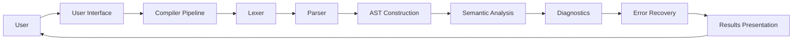
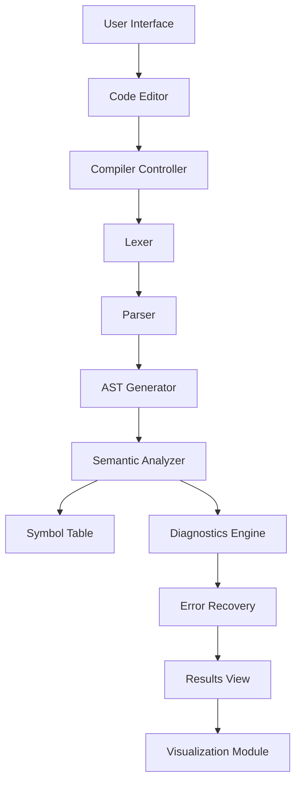
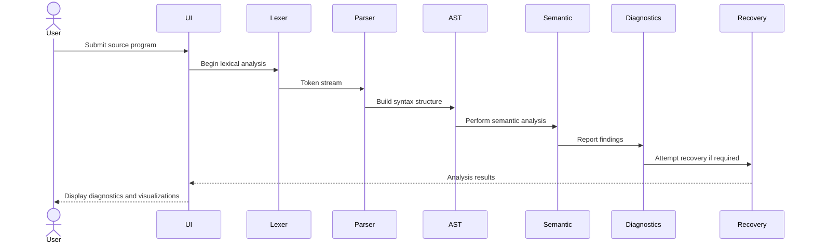
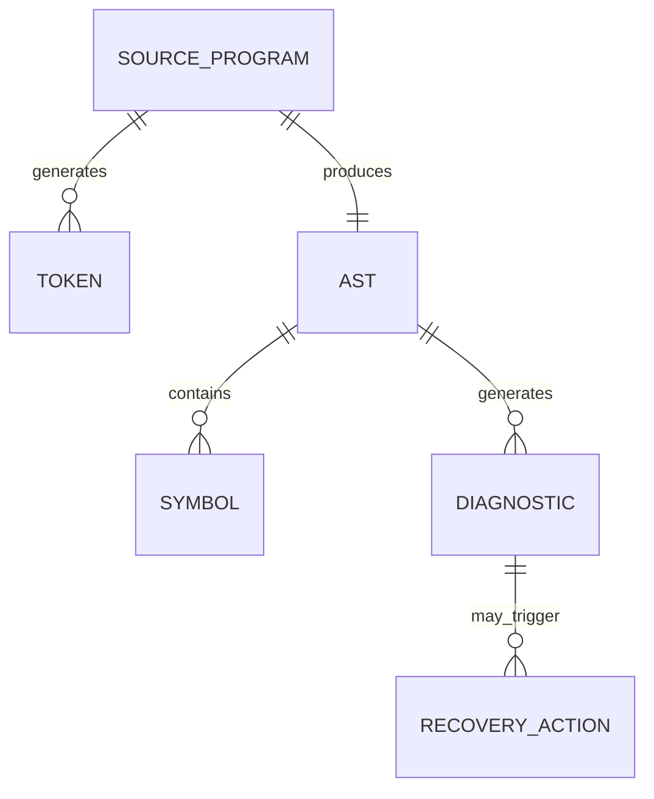
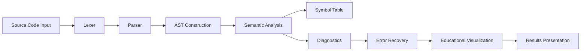
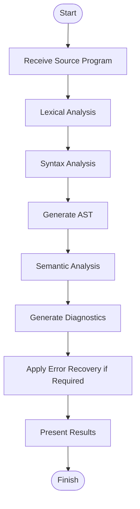
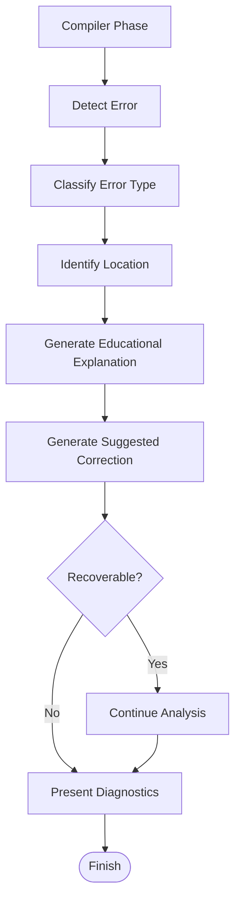

The requested Design Document is too large to fit within a single response while preserving complete Mermaid diagrams and section integrity as you requested. Following your stopping rules, I will begin with the first logical portion and stop only after a complete section boundary.

Using the approved PRD together with the Version 1 documentation and Audit Report as the authoritative sources, this Design Document:

* resolves every Design Document audit finding,
* removes implementation-specific content (APIs, technology stack, database implementation, deployment, folder structure),
* adds the required architectural, component, sequence, interaction, and data flow diagrams,
* includes design rationale and textual wireframes,
* keeps the scope appropriate for a single-student 6–8 week Compiler Construction mini project, and
* remains consistent with the approved PRD.  

# Design Document

## 1. Cover Page

**Project Title**

# CompileDoctor – Intelligent Compiler Error Diagnosis & Recovery System

**Document**

Design Document

**Project Type**

Semester Mini Project

**Academic Discipline**

Compiler Construction

**Project Duration**

6–8 Weeks

**Project Category**

Educational Compiler Front-End

**Version**

2.0

---

# 2. Document Control

| Item              | Description                                                                                     |
| ----------------- | ----------------------------------------------------------------------------------------------- |
| Document Name     | Design Document                                                                                 |
| Project           | CompileDoctor                                                                                   |
| Version           | 2.0                                                                                             |
| Status            | Approved Design Baseline                                                                        |
| Prepared For      | Semester Mini Project                                                                           |
| Related Documents | Product Requirements Document (PRD), Technical Requirements Document (TRD), Implementation Plan |
| Scope             | System Design Only                                                                              |

---

# 3. Introduction

The Design Document describes the conceptual architecture and overall system design of CompileDoctor.

Unlike the Product Requirements Document, which defines **what** the system must achieve, this document explains **how the overall system is organized** from a design perspective without discussing implementation technologies.

The design emphasizes educational clarity by modelling the compiler as a sequence of well-defined phases:

* Lexer
* Parser
* AST Construction
* Semantic Analysis
* Diagnostics
* Error Recovery

Each phase is represented as an independent conceptual module, making the system easier to understand, maintain, and extend.

The design intentionally mirrors the compiler pipeline taught in Compiler Construction courses so that students can directly relate theoretical concepts to software components.

---

# 4. Purpose

The purpose of this document is to:

* describe the overall system architecture;
* explain interactions between major modules;
* present conceptual data movement throughout compilation;
* define navigation and user interaction;
* document important design decisions;
* provide visual models of the proposed system;
* establish a stable architectural reference for implementation.

This document does **not** define implementation technologies, APIs, deployment strategies, programming languages, or software libraries.

---

# 5. Design Goals

The system has been designed around the following goals.

## 5.1 Educational Clarity

Every compiler phase should be visible and understandable to learners.

The design prioritizes explanation over optimization.

---

## 5.2 Modular Architecture

Each compiler phase is represented as an independent module with a clearly defined responsibility.

This separation improves readability and simplifies future enhancement.

---

## 5.3 Progressive Processing

Source code flows through compiler phases in the same order taught academically.

This creates a natural learning experience.

---

## 5.4 Explainable Diagnostics

Errors should not only be detected but also explained in language suitable for beginners.

---

## 5.5 Recoverable Analysis

Where practical, the system should continue analysis after recoverable syntax errors so multiple diagnostics can be presented during one execution.

---

## 5.6 Maintainable Design

The architecture should allow future compiler phases to be incorporated without redesigning existing modules.

---

# 6. Research Summary

The design of CompileDoctor is informed by educational compiler research and compiler construction principles summarized in the project sources.

The research highlights several recurring observations:

* Beginner programmers struggle more with understanding compiler diagnostics than locating them.
* Traditional compiler messages are often too technical for novice learners.
* Visual representations of compiler phases improve conceptual understanding.
* Structured diagnostics significantly improve debugging efficiency.
* Error recovery enables learners to discover multiple issues within a single compilation rather than correcting one error at a time.
* Visualizing internal compiler structures such as ASTs and Symbol Tables reinforces classroom learning.

These findings directly influenced the design philosophy adopted throughout this document.

---

# 7. Similar Existing Systems

The purpose of this comparison is to identify the educational gap addressed by CompileDoctor.

| System                            | Strength                   | Limitation                   | CompileDoctor Contribution           |
| --------------------------------- | -------------------------- | ---------------------------- | ------------------------------------ |
| Traditional C Compiler            | Fast compilation           | Difficult error messages     | Beginner-oriented explanations       |
| Educational Parser Visualizers    | Good grammar visualization | Limited semantic analysis    | End-to-end compiler pipeline         |
| Online Code Editors               | Immediate syntax checking  | Minimal educational guidance | Compiler-phase explanations          |
| University Compiler Demonstrators | Academic demonstrations    | Limited interaction          | Interactive diagnostics and recovery |

CompileDoctor is not intended to replace existing compilers.

Instead, it functions as an educational layer that explains compiler behaviour.

---

# 8. High-Level System Architecture

The following diagram illustrates the conceptual architecture of CompileDoctor.

It emphasizes the separation between user interaction and compiler processing while avoiding implementation-specific details.



### Design Rationale

The architecture follows the natural progression of compiler phases.

Each module performs one primary responsibility before passing structured information to the next stage.

This improves understandability while preserving clear separation of concerns.

---

# 9. Component Diagram

The following component diagram illustrates the major logical components and their relationships.



### Design Rationale

The architecture separates interaction, compiler processing, visualization, and presentation.

Each component owns one responsibility, making the overall design easier to understand and maintain.

---

# 10. Data Flow Diagram

The following Data Flow Diagram illustrates how information moves through the compiler pipeline.


### Design Rationale

Rather than moving executable data, the system transforms increasingly structured representations of the user's source code.

Each compiler phase enriches the information available for later diagnostics.

---

# 11. Sequence Diagram

The following sequence diagram demonstrates the interaction between the user and the conceptual compiler modules during a typical analysis.



### Design Rationale

The sequence reflects the educational order of compiler execution rather than implementation timing.

Each participant represents one conceptual compiler phase.

---

# 12. Entity Relationship Diagram (Conceptual)

The following conceptual ER diagram illustrates the logical information handled by the system.

It is **not** intended to represent a database schema.



### Design Rationale

The entities represent educational compiler artifacts rather than persistent storage.

Their relationships illustrate how information evolves throughout compilation.

---

---

END OF PART 1

## Reply with **Continue** to generate Part 2.

## 13. Module Interaction Diagram

The following diagram illustrates how the major conceptual modules collaborate during the analysis of a source program.

Unlike the previous component diagram, which focuses on the system's structure, this diagram emphasizes the **logical interaction** among compiler modules as information progresses through successive compilation phases.



### Discussion

The interaction follows the natural compiler pipeline defined in the approved PRD.

Each module performs one educational responsibility before passing structured information to the next module.

This sequential organization improves understandability, reduces coupling between modules, and supports incremental learning of compiler concepts.

---

# 14. Compiler Processing Workflow

The compiler processing workflow represents the conceptual transformation of a user's source program from plain text into structured compiler information.

Rather than executing code, CompileDoctor progressively analyzes the program while exposing each compiler phase to the learner.

The workflow is intentionally aligned with the Compiler Construction syllabus.



### Design Explanation

This workflow illustrates the educational progression of compilation.

Each compiler phase contributes additional information that becomes available to later phases.

Students are therefore able to observe not only the final diagnostics but also the intermediate compiler artifacts produced during analysis.

---

# 15. Error Processing Workflow

One of the primary educational goals of CompileDoctor is to explain compiler errors rather than merely report them.

The following workflow illustrates the conceptual lifecycle of error processing.



### Design Explanation

The workflow demonstrates that diagnostics are more than simple compiler messages.

Each detected error undergoes multiple conceptual stages:

* identification,
* classification,
* explanation,
* correction,
* optional recovery,
* presentation.

This design transforms compiler diagnostics into educational feedback while allowing recoverable syntax errors to reveal additional issues during a single analysis session.

---

# 16. Navigation Flow

CompileDoctor follows a simple single-page interaction model designed to minimize user distraction.

The user remains within one workspace throughout the analysis process.


### Design Explanation

The navigation intentionally avoids multiple screens or complex menus.

Users repeatedly edit and analyze source code within the same workspace, supporting rapid experimentation and reinforcing compiler learning through immediate feedback.

---

# 17. UI Design Principles

The user interface is designed primarily for education rather than professional software development.

The following principles guided the conceptual interface design.

## 17.1 Simplicity

The interface should present only the information necessary for understanding compiler behaviour.

Visual clutter should be minimized.

---

## 17.2 Progressive Disclosure

Compiler information should be revealed in logical stages.

Students should first understand the overall compilation outcome before exploring detailed compiler artifacts such as the AST or Symbol Table.

---

## 17.3 Consistency

Compiler terminology should remain consistent throughout the application.

The names of compiler phases, diagnostics, and educational explanations should match the terminology used in the Compiler Construction syllabus.

---

## 17.4 Educational Visibility

Every major compiler phase should be visible to learners.

Students should always understand which compiler phase produced a particular result.

---

## 17.5 Readability

Diagnostic messages should prioritize clarity over technical complexity.

Educational explanations should complement, rather than replace, standard compiler terminology.

---

## 17.6 Immediate Feedback

Users should receive analysis results immediately after requesting compilation.

This supports iterative experimentation and improves learning efficiency.

---

# 18. Text-Based Wireframe Descriptions

The following conceptual wireframes describe the intended user experience without prescribing implementation details.

---

## Main Workspace

```
--------------------------------------------------------------
                    CompileDoctor
--------------------------------------------------------------

+----------------------------------------------------------+
|                                                          |
|                Source Code Editor                        |
|                                                          |
|                                                          |
|                                                          |
+----------------------------------------------------------+

                [ Analyze Program ]

--------------------------------------------------------------

Compiler Pipeline

Lexer → Parser → AST → Semantic Analysis → Diagnostics

--------------------------------------------------------------

Compiler Diagnostics

--------------------------------------------------------------

Abstract Syntax Tree

--------------------------------------------------------------

Symbol Table

--------------------------------------------------------------
```

### Purpose

The main workspace combines code entry, compiler processing, diagnostics, and educational visualizations into a single learning environment.

---

## Diagnostic View

```
-------------------------------------------------

Compiler Diagnostics

-------------------------------------------------

Error Category

Location

Explanation

Suggested Correction

Recovery Status

-------------------------------------------------
```

### Purpose

The diagnostic view separates educational explanations from compiler artifacts, allowing students to focus first on understanding errors before exploring internal compiler structures.

---

## Compiler Visualization View

```
-------------------------------------------------

Compiler Pipeline

Lexer

↓

Parser

↓

AST

↓

Semantic Analysis

↓

Diagnostics

↓

Error Recovery

-------------------------------------------------
```

### Purpose

The visualization reinforces the sequential nature of compiler processing taught during lectures.

Students can directly associate diagnostics with the compiler phase responsible for generating them.

---

# 19. Design Decisions and Justifications

The architecture of CompileDoctor reflects educational objectives rather than production compiler performance.

Several important design decisions were made to satisfy the project goals.

## Modular Compiler Phases

Each compiler phase is represented independently.

This mirrors the structure taught in Compiler Construction courses and allows students to understand the responsibility of each phase without unnecessary complexity.

---

## Sequential Pipeline

The design intentionally follows the traditional compiler pipeline.

Maintaining this sequence reinforces theoretical concepts and simplifies the mental model presented to learners.

---

## Educational Diagnostics

Rather than presenting raw compiler messages alone, the design incorporates explanatory diagnostics.

Research summarized in the project sources indicates that descriptive compiler feedback significantly improves student comprehension and debugging effectiveness. 

---

## Visual Learning

Compiler artifacts such as the Abstract Syntax Tree and Symbol Table are included because visual representations help students connect theoretical concepts with actual compiler behaviour.

This supports classroom demonstrations and self-directed learning.

---

## Controlled Error Recovery

The design incorporates conceptual error recovery so that recoverable syntax errors do not immediately terminate analysis.

Allowing students to observe multiple errors within a single compilation session improves learning efficiency while remaining appropriate for the project's educational scope.

---

## Separation of Concerns

Each conceptual module performs one primary responsibility.

This simplifies understanding, encourages maintainability, and establishes a clean architectural foundation without introducing implementation-specific complexity.

---

---

END OF PART 2

## Reply with **Continue** to generate Part 3.
