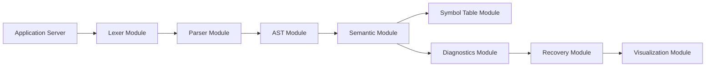

# Technical Requirements Document (TRD)

---

# 1. Cover Page

## Project Title

**CompileDoctor – Intelligent Compiler Error Diagnosis & Recovery System**

**Document**

Technical Requirements Document (TRD)

**Version**

2.0

**Project Type**

Semester Mini Project

**Course**

Compiler Construction

**Project Duration**

6–8 Weeks

---

# 2. Document Control

| Item              | Description                                                         |
| ----------------- | ------------------------------------------------------------------- |
| Document Name     | Technical Requirements Document                                     |
| Version           | 2.0                                                                 |
| Status            | Final                                                               |
| Related Documents | Product Requirements Document, Design Document, Implementation Plan |
| Scope             | Technical implementation details                                    |

---

# 3. Introduction

The Technical Requirements Document specifies the technical architecture and implementation details required to develop CompileDoctor.

Where the Product Requirements Document defines system functionality and the Design Document defines conceptual architecture, this document focuses on implementation decisions, development technologies, software organization, interfaces, and technical infrastructure.

This document serves as the primary technical reference during development.

---

# 4. Technical Objectives

The implementation should satisfy the following technical objectives.

* Develop a modular compiler front-end.
* Implement a maintainable compiler pipeline.
* Support lexical, syntax, and semantic analysis.
* Generate structured compiler diagnostics.
* Maintain clear separation between frontend and backend.
* Provide visualization-ready compiler data.
* Support future extension without major restructuring.
* Keep implementation practical for a single developer within 6–8 weeks.

---

# 5. Technology Evaluation Matrix

The following evaluation compares reasonable alternatives before selecting the implementation technologies.

## 5.1 Parser Framework

| Option                | Advantages                                                                    | Limitations                                    | Decision     |
| --------------------- | ----------------------------------------------------------------------------- | ---------------------------------------------- | ------------ |
| PLY (Python Lex-Yacc) | Simple, educational, closely models Lex/YACC concepts, integrates with Python | Less feature-rich than ANTLR                   | **Selected** |
| ANTLR                 | Powerful grammar support, multiple target languages                           | Steeper learning curve, more configuration     | Not Selected |
| Flex/Bison            | Industry standard, syllabus aligned                                           | C/C++ development increases project complexity | Not Selected |

**Justification**

PLY provides an educational implementation that closely reflects compiler construction concepts while reducing implementation complexity for a semester project.

---

## 5.2 Backend Framework

| Option  | Advantages                                          | Limitations                                           | Decision     |
| ------- | --------------------------------------------------- | ----------------------------------------------------- | ------------ |
| Flask   | Lightweight, easy integration with compiler modules | Limited built-in features                             | **Selected** |
| Django  | Rich ecosystem                                      | Excessive complexity for project scope                | Not Selected |
| FastAPI | Excellent API support                               | Additional learning overhead for project requirements | Not Selected |

**Justification**

The project requires only a small number of endpoints and a lightweight server, making Flask the most appropriate choice.

---

## 5.3 Frontend Approach

| Option              | Advantages                            | Limitations                  | Decision     |
| ------------------- | ------------------------------------- | ---------------------------- | ------------ |
| HTML/CSS/JavaScript | Lightweight, sufficient functionality | Manual UI development        | **Selected** |
| React               | Component architecture                | Additional complexity        | Not Selected |
| Angular             | Enterprise features                   | Unsuitable for project scope | Not Selected |

**Justification**

A lightweight frontend minimizes development effort while fully satisfying project requirements.

---

## 5.4 Code Editor

| Option          | Advantages                                         | Limitations               | Decision     |
| --------------- | -------------------------------------------------- | ------------------------- | ------------ |
| CodeMirror      | Lightweight, syntax highlighting, easy integration | Fewer enterprise features | **Selected** |
| Monaco Editor   | Rich editing experience                            | Larger footprint          | Not Selected |
| Plain Text Area | Simplest implementation                            | Poor editing experience   | Not Selected |

**Justification**

CodeMirror provides sufficient functionality without unnecessary overhead.

---

## 5.5 AST Visualization

| Option     | Advantages                            | Limitations                         | Decision     |
| ---------- | ------------------------------------- | ----------------------------------- | ------------ |
| Graphviz   | Clear tree visualization, educational | Static rendering                    | **Selected** |
| D3.js      | Interactive visualizations            | Increased implementation complexity | Optional     |
| Custom SVG | Full control                          | Time consuming                      | Not Selected |

**Justification**

Graphviz offers high-quality educational visualizations while remaining practical within the project timeline.

---

# 6. Selected Technology Stack

| Layer                     | Technology            | Justification                                 |
| ------------------------- | --------------------- | --------------------------------------------- |
| Programming Language      | Python                | Rapid development and strong compiler tooling |
| Frontend                  | HTML, CSS, JavaScript | Lightweight and sufficient for educational UI |
| Backend                   | Flask                 | Simple web application framework              |
| Lexical & Syntax Analysis | PLY                   | Closely models compiler theory concepts       |
| Visualization             | Graphviz              | Educational AST visualization                 |
| Data Storage              | SQLite (optional)     | Lightweight persistence for optional features |
| Version Control           | Git                   | Source code management                        |
| Documentation             | Markdown              | Consistent academic documentation             |

---

# 7. Development Environment

| Component        | Requirement                              |
| ---------------- | ---------------------------------------- |
| Operating System | Windows, Linux, or macOS                 |
| IDE              | Visual Studio Code or PyCharm            |
| Python           | Version 3.10 or later                    |
| Browser          | Modern Chromium-based browser or Firefox |
| Version Control  | Git                                      |
| Package Manager  | pip                                      |

---

# 8. Software Requirements

| Software            | Purpose                         |
| ------------------- | ------------------------------- |
| Python              | Backend execution               |
| Flask               | Web server                      |
| PLY                 | Lexer and parser implementation |
| Graphviz            | AST rendering                   |
| HTML/CSS/JavaScript | Frontend interface              |
| Git                 | Source control                  |

---

# 9. Hardware Requirements

## Development System

| Component | Minimum              |
| --------- | -------------------- |
| Processor | Dual Core CPU        |
| RAM       | 8 GB                 |
| Storage   | 5 GB Free Space      |
| Display   | 1366 × 768 or higher |

---

## Deployment System

Minimal server resources are sufficient because the application performs lightweight compiler analysis rather than code execution.

---

# 10. Project Folder Structure

```text
CompileDoctor/

├── backend/
│   ├── lexer/
│   ├── parser/
│   ├── semantic/
│   ├── diagnostics/
│   ├── recovery/
│   ├── ast/
│   ├── symbol_table/
│   └── server/
│
├── frontend/
│   ├── editor/
│   ├── visualizer/
│   ├── components/
│   └── assets/
│
├── database/
│
├── tests/
│
├── examples/
│
├── documentation/
│
└── README.md
```

### Folder Organization

* **backend/** contains compiler processing modules.
* **frontend/** contains user interface components.
* **database/** stores optional persistence files.
* **tests/** contains automated tests.
* **examples/** stores demonstration programs.
* **documentation/** stores project reports.

---

# 11. Module Architecture

The following diagram illustrates the technical organization of implementation modules.



The module organization mirrors the compiler pipeline while keeping implementation responsibilities isolated. Each module exposes only the information required by the next processing stage, improving maintainability and simplifying testing.

---

# 12. Database Schema

Persistent storage is optional and intended only for supplementary educational features such as saved analysis sessions or example programs. Core compiler analysis operates independently of database storage.

| Table             | Purpose                               | Key Fields                                       |
| ----------------- | ------------------------------------- | ------------------------------------------------ |
| `sessions`        | Store saved analysis sessions         | session_id, source_code, created_at              |
| `examples`        | Store sample programs                 | example_id, title, source_code                   |
| `error_templates` | Reusable diagnostic message templates | template_id, error_type, explanation, suggestion |

The database is intentionally minimal to remain appropriate for the project scope.

---

# 13. API Specifications

The backend exposes a small REST interface to support communication between the frontend and compiler engine.

| Method | Endpoint    | Purpose                                     |
| ------ | ----------- | ------------------------------------------- |
| POST   | `/analyze`  | Submit source code for compilation analysis |
| GET    | `/examples` | Retrieve available sample programs          |
| GET    | `/health`   | Verify application status                   |

### POST `/analyze`

**Request Body**

```json
{
  "source_code": "..."
}
```

**Response Structure**

```json
{
  "tokens": [],
  "ast": {},
  "symbol_table": [],
  "diagnostics": [],
  "status": "success"
}
```

---

END OF PART 1

Reply with **Continue** to generate Part 2.
