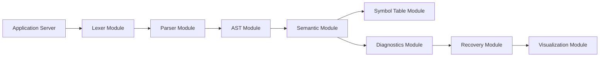
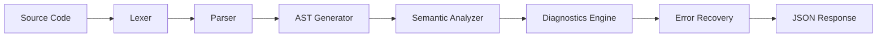

# Technical Requirements Document (TRD)

---

# 1. Cover Page

## Project Title

**CompileDoctor – Intelligent Compiler Error Diagnosis & Recovery System**

**Document**

Technical Requirements Document (TRD)

**Version**

2.0

**Project Type**

Semester Mini Project

**Course**

Compiler Construction

**Project Duration**

6–8 Weeks

---

# 2. Document Control

| Item              | Description                                                         |
| ----------------- | ------------------------------------------------------------------- |
| Document Name     | Technical Requirements Document                                     |
| Version           | 2.0                                                                 |
| Status            | Final                                                               |
| Related Documents | Product Requirements Document, Design Document, Implementation Plan |
| Scope             | Technical implementation details                                    |

---

# 3. Introduction

The Technical Requirements Document specifies the technical architecture and implementation details required to develop CompileDoctor.

Where the Product Requirements Document defines system functionality and the Design Document defines conceptual architecture, this document focuses on implementation decisions, development technologies, software organization, interfaces, and technical infrastructure.

This document serves as the primary technical reference during development.

---

# 4. Technical Objectives

The implementation should satisfy the following technical objectives.

* Develop a modular compiler front-end.
* Implement a maintainable compiler pipeline.
* Support lexical, syntax, and semantic analysis.
* Generate structured compiler diagnostics.
* Maintain clear separation between frontend and backend.
* Provide visualization-ready compiler data.
* Support future extension without major restructuring.
* Keep implementation practical for a single developer within 6–8 weeks.

---

# 5. Technology Evaluation Matrix

The following evaluation compares reasonable alternatives before selecting the implementation technologies.

## 5.1 Parser Framework

| Option                | Advantages                                                                    | Limitations                                    | Decision     |
| --------------------- | ----------------------------------------------------------------------------- | ---------------------------------------------- | ------------ |
| PLY (Python Lex-Yacc) | Simple, educational, closely models Lex/YACC concepts, integrates with Python | Less feature-rich than ANTLR                   | **Selected** |
| ANTLR                 | Powerful grammar support, multiple target languages                           | Steeper learning curve, more configuration     | Not Selected |
| Flex/Bison            | Industry standard, syllabus aligned                                           | C/C++ development increases project complexity | Not Selected |

**Justification**

PLY provides an educational implementation that closely reflects compiler construction concepts while reducing implementation complexity for a semester project.

---

## 5.2 Backend Framework

| Option  | Advantages                                          | Limitations                                           | Decision     |
| ------- | --------------------------------------------------- | ----------------------------------------------------- | ------------ |
| Flask   | Lightweight, easy integration with compiler modules | Limited built-in features                             | **Selected** |
| Django  | Rich ecosystem                                      | Excessive complexity for project scope                | Not Selected |
| FastAPI | Excellent API support                               | Additional learning overhead for project requirements | Not Selected |

**Justification**

The project requires only a small number of endpoints and a lightweight server, making Flask the most appropriate choice.

---

## 5.3 Frontend Approach

| Option              | Advantages                            | Limitations                  | Decision     |
| ------------------- | ------------------------------------- | ---------------------------- | ------------ |
| HTML/CSS/JavaScript | Lightweight, sufficient functionality | Manual UI development        | **Selected** |
| React               | Component architecture                | Additional complexity        | Not Selected |
| Angular             | Enterprise features                   | Unsuitable for project scope | Not Selected |

**Justification**

A lightweight frontend minimizes development effort while fully satisfying project requirements.

---

## 5.4 Code Editor

| Option          | Advantages                                         | Limitations               | Decision     |
| --------------- | -------------------------------------------------- | ------------------------- | ------------ |
| CodeMirror      | Lightweight, syntax highlighting, easy integration | Fewer enterprise features | **Selected** |
| Monaco Editor   | Rich editing experience                            | Larger footprint          | Not Selected |
| Plain Text Area | Simplest implementation                            | Poor editing experience   | Not Selected |

**Justification**

CodeMirror provides sufficient functionality without unnecessary overhead.

---

## 5.5 AST Visualization

| Option     | Advantages                            | Limitations                         | Decision     |
| ---------- | ------------------------------------- | ----------------------------------- | ------------ |
| Graphviz   | Clear tree visualization, educational | Static rendering                    | **Selected** |
| D3.js      | Interactive visualizations            | Increased implementation complexity | Optional     |
| Custom SVG | Full control                          | Time consuming                      | Not Selected |

**Justification**

Graphviz offers high-quality educational visualizations while remaining practical within the project timeline.

---

# 6. Selected Technology Stack

| Layer                     | Technology            | Justification                                 |
| ------------------------- | --------------------- | --------------------------------------------- |
| Programming Language      | Python                | Rapid development and strong compiler tooling |
| Frontend                  | HTML, CSS, JavaScript | Lightweight and sufficient for educational UI |
| Backend                   | Flask                 | Simple web application framework              |
| Lexical & Syntax Analysis | PLY                   | Closely models compiler theory concepts       |
| Visualization             | Graphviz              | Educational AST visualization                 |
| Data Storage              | SQLite (optional)     | Lightweight persistence for optional features |
| Version Control           | Git                   | Source code management                        |
| Documentation             | Markdown              | Consistent academic documentation             |

---

# 7. Development Environment

| Component        | Requirement                              |
| ---------------- | ---------------------------------------- |
| Operating System | Windows, Linux, or macOS                 |
| IDE              | Visual Studio Code or PyCharm            |
| Python           | Version 3.10 or later                    |
| Browser          | Modern Chromium-based browser or Firefox |
| Version Control  | Git                                      |
| Package Manager  | pip                                      |

---

# 8. Software Requirements

| Software            | Purpose                         |
| ------------------- | ------------------------------- |
| Python              | Backend execution               |
| Flask               | Web server                      |
| PLY                 | Lexer and parser implementation |
| Graphviz            | AST rendering                   |
| HTML/CSS/JavaScript | Frontend interface              |
| Git                 | Source control                  |

---

# 9. Hardware Requirements

## Development System

| Component | Minimum              |
| --------- | -------------------- |
| Processor | Dual Core CPU        |
| RAM       | 8 GB                 |
| Storage   | 5 GB Free Space      |
| Display   | 1366 × 768 or higher |

---

## Deployment System

Minimal server resources are sufficient because the application performs lightweight compiler analysis rather than code execution.

---

# 10. Project Folder Structure

```text
CompileDoctor/

├── backend/
│   ├── lexer/
│   ├── parser/
│   ├── semantic/
│   ├── diagnostics/
│   ├── recovery/
│   ├── ast/
│   ├── symbol_table/
│   └── server/
│
├── frontend/
│   ├── editor/
│   ├── visualizer/
│   ├── components/
│   └── assets/
│
├── database/
│
├── tests/
│
├── examples/
│
├── documentation/
│
└── README.md
```

### Folder Organization

* **backend/** contains compiler processing modules.
* **frontend/** contains user interface components.
* **database/** stores optional persistence files.
* **tests/** contains automated tests.
* **examples/** stores demonstration programs.
* **documentation/** stores project reports.

---

# 11. Module Architecture

The following diagram illustrates the technical organization of implementation modules.



The module organization mirrors the compiler pipeline while keeping implementation responsibilities isolated. Each module exposes only the information required by the next processing stage, improving maintainability and simplifying testing.

---

# 12. Database Schema

Persistent storage is optional and intended only for supplementary educational features such as saved analysis sessions or example programs. Core compiler analysis operates independently of database storage.

| Table             | Purpose                               | Key Fields                                       |
| ----------------- | ------------------------------------- | ------------------------------------------------ |
| `sessions`        | Store saved analysis sessions         | session_id, source_code, created_at              |
| `examples`        | Store sample programs                 | example_id, title, source_code                   |
| `error_templates` | Reusable diagnostic message templates | template_id, error_type, explanation, suggestion |

The database is intentionally minimal to remain appropriate for the project scope.

---

# 13. API Specifications

The backend exposes a small REST interface to support communication between the frontend and compiler engine.

| Method | Endpoint    | Purpose                                     |
| ------ | ----------- | ------------------------------------------- |
| POST   | `/analyze`  | Submit source code for compilation analysis |
| GET    | `/examples` | Retrieve available sample programs          |
| GET    | `/health`   | Verify application status                   |

### POST `/analyze`

**Request Body**

```json
{
  "source_code": "..."
}
```

**Response Structure**

```json
{
  "tokens": [],
  "ast": {},
  "symbol_table": [],
  "diagnostics": [],
  "status": "success"
}
```

---

END OF PART 1

Reply with **Continue** to generate Part 2.

## 14. Backend Modules

The backend is organized into independent modules corresponding to compiler phases. This modular structure simplifies maintenance, testing, and future enhancements.

| Module                    | Responsibility                                 | Input                  | Output              |
| ------------------------- | ---------------------------------------------- | ---------------------- | ------------------- |
| **Lexer**                 | Convert source code into tokens                | Source Code            | Token Stream        |
| **Parser**                | Validate grammar and construct parse structure | Token Stream           | Parse Structure     |
| **AST Generator**         | Build Abstract Syntax Tree                     | Parse Structure        | AST                 |
| **Semantic Analyzer**     | Perform semantic validation                    | AST                    | Semantic Results    |
| **Symbol Table Manager**  | Maintain identifier information                | AST                    | Symbol Table        |
| **Diagnostics Engine**    | Generate compiler diagnostics                  | Semantic Results       | Diagnostic Messages |
| **Error Recovery Module** | Recover from supported syntax errors           | Diagnostic Information | Recovered Analysis  |
| **Visualization Adapter** | Prepare visualization data                     | AST, Symbol Table      | Visualization Data  |

### Module Responsibilities

* **Lexer** identifies keywords, identifiers, literals, operators, delimiters, and lexical errors.
* **Parser** validates the grammar and produces the program structure.
* **AST Generator** simplifies the parse structure into an Abstract Syntax Tree.
* **Semantic Analyzer** performs semantic validation such as type checking and declaration verification.
* **Symbol Table Manager** records identifiers, scopes, and data types.
* **Diagnostics Engine** transforms compiler findings into structured educational messages.
* **Error Recovery Module** attempts recovery using supported techniques before continuing compilation.
* **Visualization Adapter** converts compiler structures into a format suitable for graphical display.

---

# 15. Frontend Modules

The frontend provides an interactive interface for source code analysis and presentation of compiler outputs.

| Module                 | Responsibility                            |
| ---------------------- | ----------------------------------------- |
| Code Editor            | Source code entry and editing             |
| Compiler Pipeline View | Displays compiler phase progression       |
| Diagnostics Panel      | Displays compiler errors and explanations |
| AST Viewer             | Displays Abstract Syntax Tree             |
| Symbol Table Viewer    | Displays identifier information           |
| Token Viewer           | Displays lexical analysis results         |
| Example Loader         | Loads sample programs                     |

The frontend communicates with the backend exclusively through the defined REST endpoints and contains no compiler logic.

---

# 16. Compiler Error Processing Pipeline

The following technical pipeline illustrates how compiler data moves between implementation modules.



### Processing Stages

1. Source code is submitted by the client.
2. Lexical analysis produces a token stream.
3. Parsing validates syntax and builds the parse structure.
4. AST generation constructs the Abstract Syntax Tree.
5. Semantic analysis validates declarations and types.
6. Diagnostics are generated.
7. Error recovery attempts supported corrections.
8. Structured results are returned to the frontend.

---

# 17. Logging Strategy

Logging assists debugging, testing, and maintenance.

## Log Categories

| Category            | Purpose                                                |
| ------------------- | ------------------------------------------------------ |
| Application Startup | Verify successful initialization                       |
| API Requests        | Record analysis requests                               |
| Compiler Errors     | Store unexpected internal compiler exceptions          |
| Diagnostics         | Record generated compiler diagnostics during debugging |
| Recovery Events     | Record recovery attempts for parser debugging          |

## Logging Levels

| Level   | Usage                     |
| ------- | ------------------------- |
| INFO    | Normal application events |
| WARNING | Recoverable issues        |
| ERROR   | Compiler failures         |
| DEBUG   | Development diagnostics   |

Log files should remain concise and exclude user-sensitive information.

---

# 18. Testing Strategy

Testing is divided into unit, integration, and user interface validation.

## Unit Testing

| Module             | Test Focus                            |
| ------------------ | ------------------------------------- |
| Lexer              | Token recognition, invalid characters |
| Parser             | Grammar validation                    |
| AST Generator      | Correct tree construction             |
| Semantic Analyzer  | Type checking, undeclared identifiers |
| Diagnostics Engine | Correct explanation generation        |
| Error Recovery     | Recovery from supported syntax errors |

---

## Integration Testing

Integration tests verify interaction between compiler phases.

Typical scenarios include:

* Complete successful compilation
* Multiple syntax errors
* Lexical errors
* Semantic errors
* Mixed error conditions

---

## User Interface Testing

UI testing verifies:

* Code submission
* Results display
* AST visualization
* Symbol table rendering
* Diagnostic presentation

---

## Sample Test Cases

| Test Case           | Expected Result            |
| ------------------- | -------------------------- |
| Valid Program       | Successful analysis        |
| Invalid Identifier  | Lexical error              |
| Missing Semicolon   | Syntax error with recovery |
| Undeclared Variable | Semantic error             |
| Type Mismatch       | Semantic diagnostic        |

---

# 19. Security Considerations

Although CompileDoctor is an educational application, several basic security measures are incorporated.

| Consideration      | Purpose                                  |
| ------------------ | ---------------------------------------- |
| Input Validation   | Prevent malformed requests               |
| HTML Escaping      | Prevent cross-site scripting             |
| No Code Execution  | User programs are analyzed, not executed |
| Exception Handling | Prevent application crashes              |
| Request Validation | Ensure valid API requests                |

No authentication or authorization mechanisms are required because the application is intended primarily for standalone educational use.

---

# 20. Deployment Requirements

The application is designed for lightweight deployment.

## Runtime Environment

| Requirement      | Value                                             |
| ---------------- | ------------------------------------------------- |
| Python Runtime   | Python 3.10+                                      |
| Web Server       | Flask Development Server (academic demonstration) |
| Browser          | Modern Web Browser                                |
| Operating System | Windows, Linux, or macOS                          |

## Installation Requirements

* Python installed
* Required Python packages installed
* Graphviz available (if AST visualization is enabled)
* Internet connection not required after installation

---

# 21. Risks and Mitigation

| Risk                      | Impact                    | Mitigation                                           |
| ------------------------- | ------------------------- | ---------------------------------------------------- |
| Grammar ambiguity         | Parser instability        | Simplify grammar and validate productions early      |
| Error recovery complexity | Incorrect diagnostics     | Limit recovery to common educational cases           |
| Visualization issues      | Reduced educational value | Provide textual fallback representations             |
| Scope expansion           | Project delays            | Restrict implementation to MVP defined in the PRD    |
| Limited testing time      | Undetected defects        | Prioritize automated unit tests for compiler modules |

---

# 22. Technical Constraints

The implementation is subject to the following technical constraints.

* Single-developer implementation.
* Development completed within 6–8 weeks.
* Compiler front-end only.
* Educational rather than production-grade compiler.
* Modular implementation aligned with compiler phases.
* Lightweight architecture suitable for local execution.
* Minimal external dependencies.

---

# 23. Future Technical Enhancements

The modular architecture allows several technical improvements without major restructuring.

## Compiler Features

* Intermediate Representation (IR)
* Three-Address Code generation
* Control Flow Graph generation
* Optimization demonstrations
* Target code generation

---

## Visualization

* Interactive AST exploration
* Parse tree visualization
* Symbol table animation
* Compiler execution timeline

---

## User Experience

* Additional sample programs
* Export analysis reports
* Session history
* Dark mode interface

---

## Educational Enhancements

* Guided compiler walkthroughs
* Interactive grammar tracing
* Syntax prediction assistance
* Compiler learning exercises

---

# Internal Technical Review Checklist

The following verification was completed before finalizing this document.

| Review Item                                        | Status |
| -------------------------------------------------- | ------ |
| Regenerated from scratch                           | ✓      |
| Based on approved PRD                              | ✓      |
| Consistent with approved Design Document           | ✓      |
| TRD audit findings resolved                        | ✓      |
| Technology evaluation matrix included              | ✓      |
| Technology selections justified                    | ✓      |
| Development environment specified                  | ✓      |
| Software requirements specified                    | ✓      |
| Hardware requirements specified                    | ✓      |
| Folder structure included                          | ✓      |
| Module architecture included                       | ✓      |
| Database schema included                           | ✓      |
| API specifications included                        | ✓      |
| Backend modules documented                         | ✓      |
| Frontend modules documented                        | ✓      |
| Compiler processing pipeline included              | ✓      |
| Logging strategy expanded                          | ✓      |
| Testing strategy expanded                          | ✓      |
| Security considerations included                   | ✓      |
| Deployment requirements included                   | ✓      |
| Risks and mitigation included                      | ✓      |
| Technical constraints included                     | ✓      |
| Future technical enhancements included             | ✓      |
| No duplication of functional requirements from PRD | ✓      |
| Suitable for academic submission                   | ✓      |

# End of Technical Requirements Document
